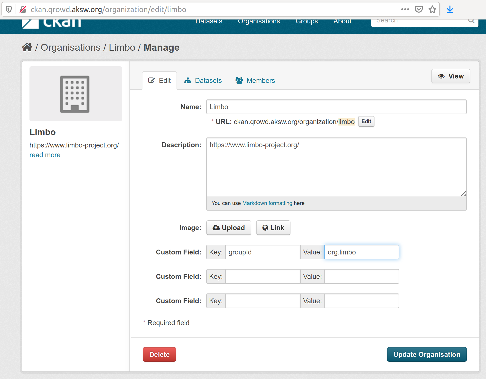

## Deployment to CKAN


### Notes about Describing DCAT Datasets

The following data is an excerpt from [example.release.dcat.ttl](example.release.dcat.ttl).

```turtle
@prefix dataid: <http://dataid.dbpedia.org/ns/core#> .

mcloud:dataset-org.limbo-train_2-0.2
        a                    cat:Dataset ;
        dataid:artifact      "train_2" ;
        dataid:group         "org.limbo" ;
        dcterms:identifier   "org.limbo:train_2:0.2" ;
        dcterms:issued       "2020-04-07T14:11:18.726+02:00"^^<http://www.w3.org/2001/XMLSchema#dateTime> ;
        dcterms:license      limbo:NullLicense ;
        dcterms:description  "This is the train_2 dataset" ;
        void:triples         2429 ;
        owl:priorVersion     mcloud:dataset-org.limbo-train_2-0.1 ;
        owl:versionInfo      "0.2" ;
        cat:distribution     mcloud:distribution-org.limbo-train_2-0.2_train_2-dataset.ttl ;
        prov:wasDerivedFrom  mcloud:distribution-5670eb707309b5e1523b0d97fb0353ac .

mcloud:distribution-org.limbo-train_2-0.2_train_2-dataset.ttl
        a                cat:Distribution ;
        eg:localId       "train_2-dataset.ttl" ;
        cat:downloadURL  <https://gitlab.com/limbo-project/train_2-dataset/raw/v0.2/release/train_2-dataset.ttl> .
```

By default, CKAN deployment using the dcat suite creates dataset records in namespace of the user that uploads the data identified by the given api key.
The dcat suite supports mapping datasets into the namespace of CKAN organization in two ways:

* Using a command line option on the `dcat deploy ckan` command
* By describing datasets with `dataid:group`.

If `dataid:group "mygroup"` is given then a lookup on CKAN is performed to find organizations carrying a tag with key `groupId` with value `mygroup`.
Organizations can be tagged as shown in the screenshot below.

test{:height="50%"}

> :wrench: DBpedia Databus groupId / artifactId are inspired by maven however DataId uses IRIs whereas DCAT client needs strings. As a consequence the properties need to be renamed.

## Deployment of DCAT data to CKAN

The basic command for upload DCAT metadata including the actual datasets is:

```bash
dcat deploy ckan --url https://example.org/ckan --apikey=SECRET example.release.dcat.ttl
```

If `--noupload` is given then the CKAN entries for datasets and resources will still be created but
no actual datasets will be uploaded. The CKAN resources will link to any data referred to by `dcat:downloadURL` triples.


The full options are:

```
Usage: dcat deploy ckan [--no-group-map] [--noupload] [--apikey=<apikey>]
                        [-o=<organization>] [--url=<ckanUrl>] <file>
Deploy DCAT datasets to CKAN
      <file>              The DCAT file which to deploy
      --apikey=<apikey>   Your API key for the CKAN instance
      --no-group-map      Disable mapping organization by group attribute.
      --noupload          Disable file upload
  -o, --org, --orga, --organization=<organization>
                          The ID or name of the organization into which to
                            upload (matched in this order).
      --url=<ckanUrl>     The URL of the CKAN instance
```

Running the command on the example data creates the following CKAN entry which can also be viewed on [http://ckan.qrowd.aksw.org/dataset/org-limbo-train_2-0-2](http://ckan.qrowd.aksw.org/dataset/org-limbo-train_2-0-2):


## Import CKAN data as DCAT

CKAN data can also be imported as DCAT using the command

```bash
dcat ckan import ckan  --url https://example.org/ckan --ds org-limbo-train_2-0-2
```

The full options are:

```bash
Usage: dcat import ckan [--all] [--apikey=<apikey>] [--prefix=<prefix>]
                        --url=<ckanUrl> [--ds=<datasets>]...
Retrieve DCAT descriptions from CKAN
      --all               Import everything
      --apikey=<apikey>   Your API key for the CKAN instance
      --ds, --dataset=<datasets>
                          Import a specific datasets (ckan id or name)
      --prefix=<prefix>   Allocate URIs using this prefix
      --url=<ckanUrl>     The URL of the CKAN instance

```


## Mapping CKAN to DCAT
The approach to mapping between DCAT and CKAN data is a hybrid programmatic / declarative one. The programmatic part hard codes the structure of the DCAT-AP domain which comprises classes such as Dataset, Distribution, Publisher, ContactPoint and Hashes. The mapping of the attributes is declarative in RDF.

* Declarative Mapping: [dcat-ap-ckan-mapping.ttl](../../../dcat-suite-binding-ckan/src/main/resources/dcat-ap-ckan-mapping.ttl)
* The main class that processes th mappings: [CkanPseudoNodeFactory.java](../../../dcat-suite-binding-ckan/src/main/java/org/aksw/dcat/ap/binding/ckan/rdf_view/CkanPseudoNodeFactory.java)


